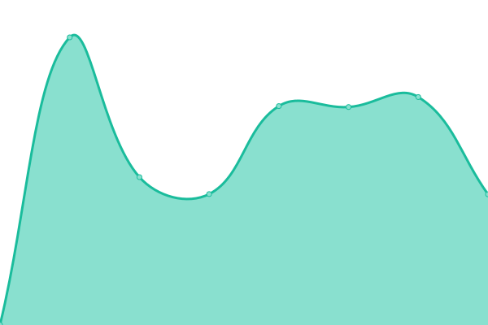
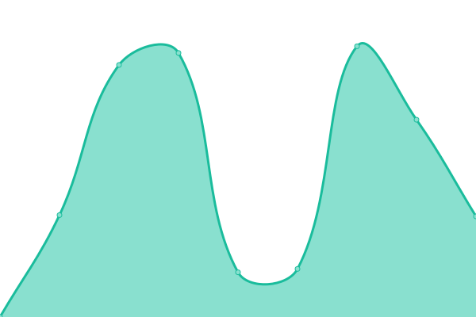
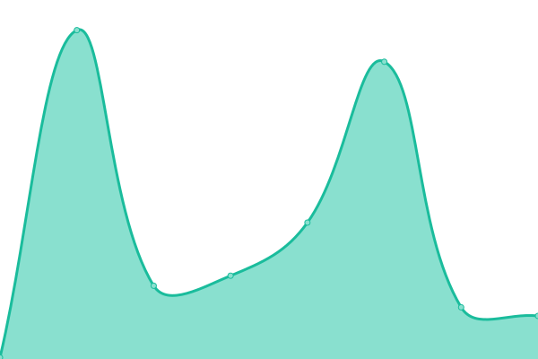

# [📈 Live Status](https://rikrdo1979.github.io/upptime): <!--live status--> **🟩 All systems operational**

This repository contains the open-source uptime monitor and status page for [Ricardo Echeverriabarrena](www.rikrdo.es/cv), powered by [Upptime](https://github.com/upptime/upptime).

With [Upptime](https://upptime.js.org), you can get your own unlimited and free uptime monitor and status page, powered entirely by a GitHub repository. We use [Issues](https://github.com/rikrdo1979/upptime/issues) as incident reports, [Actions](https://github.com/rikrdo1979/upptime/actions) as uptime monitors, and [Pages](https://rikrdo1979.github.io/upptime) for the status page.

<!--start: status pages-->
<!-- This summary is generated by Upptime (https://github.com/upptime/upptime) -->
<!-- Do not edit this manually, your changes will be overwritten -->
<!-- prettier-ignore -->
| URL | Status | History | Response Time | Uptime |
| --- | ------ | ------- | ------------- | ------ |
|  [Google](https://www.google.com) | 🟩 Up | [google.yml](https://github.com/rikrdo1979/upptime/commits/HEAD/history/google.yml) | 

 92ms
     
 | 

<a href="https://rikrdo1979.github.io/upptime/history/google">100.00%</a>
    

|  [Natural](https://www.mercadodevida.es) | 🟩 Up | [natural.yml](https://github.com/rikrdo1979/upptime/commits/HEAD/history/natural.yml) | 

 2337ms
     
 | 

<a href="https://rikrdo1979.github.io/upptime/history/natural">100.00%</a>
    

|  [comerecologico.com](https://www.comerecologico.com) | 🟩 Up | [comerecologico-com.yml](https://github.com/rikrdo1979/upptime/commits/HEAD/history/comerecologico-com.yml) | 

 949ms
     
 | 

<a href="https://rikrdo1979.github.io/upptime/history/comerecologico-com">100.00%</a>
    

|  [rikrdo.es](https://www.rikrdo.es/cv) | 🟩 Up | [rikrdo-es.yml](https://github.com/rikrdo1979/upptime/commits/HEAD/history/rikrdo-es.yml) | 

 1075ms
     
 | 

<a href="https://rikrdo1979.github.io/upptime/history/rikrdo-es">100.00%</a>
    

|  [Lugar de la Luz](https://www.lugardelaluz.es/guests) | 🟩 Up | [lugar-de-la-luz.yml](https://github.com/rikrdo1979/upptime/commits/HEAD/history/lugar-de-la-luz.yml) | 

 817ms
     
 | 

<a href="https://rikrdo1979.github.io/upptime/history/lugar-de-la-luz">100.00%</a>
    

|  [Terapia Visual](https://terapiavisualsanpedrodealcantara.com) | 🟩 Up | [terapia-visual.yml](https://github.com/rikrdo1979/upptime/commits/HEAD/history/terapia-visual.yml) | 

 1217ms
     
 | 

<a href="https://rikrdo1979.github.io/upptime/history/terapia-visual">96.19%</a>
    

|  [Nextcloud Pi](https://ftprikrdo.duckdns.org) | 🟩 Up | [nextcloud-pi.yml](https://github.com/rikrdo1979/upptime/commits/HEAD/history/nextcloud-pi.yml) | 

 2500ms
     
 | 

<a href="https://rikrdo1979.github.io/upptime/history/nextcloud-pi">100.00%</a>
    

|  [Gitea](http://gitrikrdo.duckdns.org:3000) | 🟩 Up | [gitea.yml](https://github.com/rikrdo1979/upptime/commits/HEAD/history/gitea.yml) | 

 605ms
     
 | 

<a href="https://rikrdo1979.github.io/upptime/history/gitea">100.00%</a>
    

|  [NAS Synology](http://mercadodevida.quickconnect.to/) | 🟩 Up | [nas-synology.yml](https://github.com/rikrdo1979/upptime/commits/HEAD/history/nas-synology.yml) | 

 67ms
     
 | 

<a href="https://rikrdo1979.github.io/upptime/history/nas-synology">100.00%</a>
    

<!--end: status pages-->

[**Visit our status website →**](https://rikrdo1979.github.io/upptime)

## 📄 License

- Powered by: [Upptime](https://github.com/upptime/upptime)
- Code: [MIT](./LICENSE) © [Ricardo Echeverriabarrena](www.rikrdo.es/cv)
- Data in the `./history` directory: [Open Database License](https://opendatacommons.org/licenses/odbl/1-0/)
